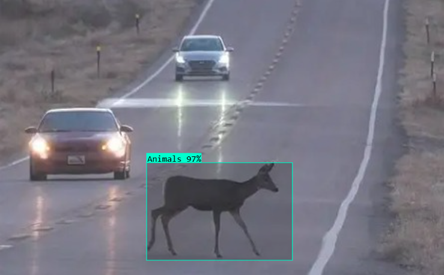
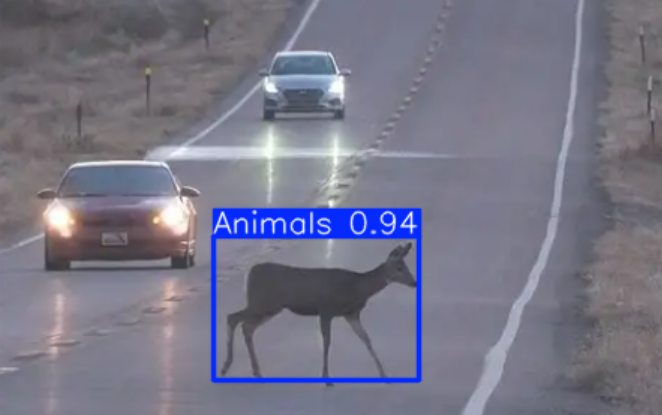
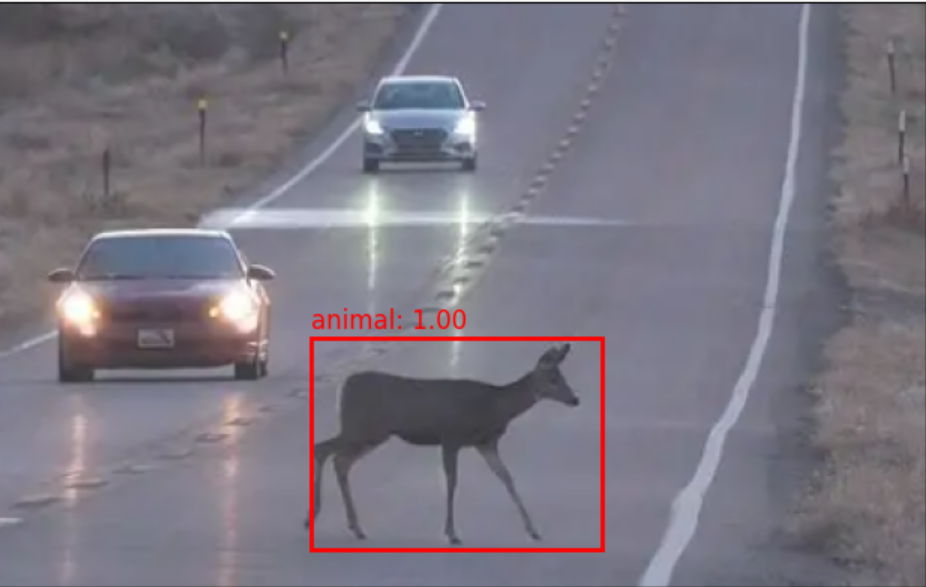

# Model-Comparision Report:
This Repositry contains a comparision of object detection models (Roboflow, YOLOv8, YOLOv10, Faster R-CNN)
# Model comparison: 
The models were evaluated using standard object detection metrics: mAP, Precision, and Recall. These metrics provided clear comparison of model performance. The following table summarizes the results. including the algorithm name, accuracy metrics, and the outcome of sample test image.

| Algorithm     | Accuracy metrics                                           | Test Image          
----------------|:----------------------------------------------------------:|-------------------
| Roboflow      |  mAP@50: 84.7%   Precision: 85.8%   Recall: 75.6%    |
|  YOLOv8       | mAP@50: 83.77%   Precision: 88.44%   Recall: 72.88%  |
| YOLOv10       | mAP@50: 73.86%   Precision: 77.12%   Recall: 64.25%  |   
| Faster R-CNN  | mAP@50: 80.45%   Precision: 37.72%   Recall: 47.12%  |

# best mosel Based on result : 
The Roboflow baseline achieved the best overall performance with balanced Precision and Recall. YOLOv8 was very close and had the highest Precision, but lower Recall. Faster R-CNN achieved an acceptable mAP but showed very low Precision and Recall, while YOLOv10 performed weaker overall.  
This means that the Roboflow bassline is the most accurate, followed by YOLOv8.    
In conclusion, this comparison highlights each algorithm and the importance of evaluating model using multiple metrics rather than focusing on a single metrics.

      

